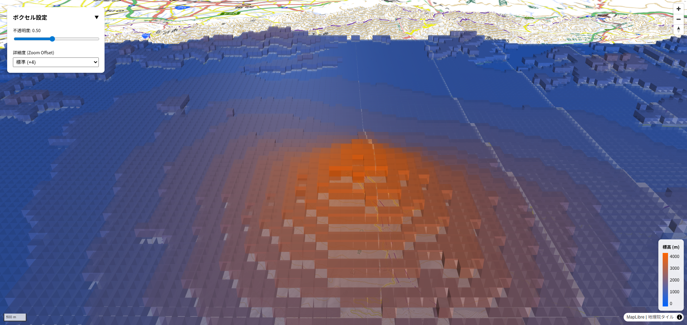

# Terrain Voxelizer

DEM（デジタル標高モデル）タイルから動的にSpatial IDボクセルを生成するためのライブラリです。
MapLibre GL JS と Deck.gl との連携を容易にする React Hooks やコンポーネントも提供します。



> **Note**: 現在のバージョンは **MapLibre GL JS** との連携機能が主ですが、Core ロジックは地図ライブラリに依存しない設計となっています。将来的に Cesium 等への対応も計画しています。

## 📦 インストール

```bash
# GitHubからインストールする場合
npm install github:Strorkis/spatial-id-terrain-voxelizer
# or
pnpm add github:Strorkis/spatial-id-terrain-voxelizer
```

## 🚀 開発とデモ (example)

リポジトリ内のデモアプリ (`examples/demo`) を実行するには以下の手順を行います。

1. **セットアップ**:

   ```bash
   # ライブラリの依存関係インストール
   pnpm install

   # デモアプリの依存関係インストール
   cd examples/demo
   pnpm install
   cd ../..
   ```

2. **デモ起動**:

   ```bash
   # ライブラリのビルドとデモアプリの起動
   pnpm run dev
   ```

3. **ライブラリのビルド**:

   ```bash
   pnpm run build
   ```

## 📖 API

### Core (`import ... from 'spatial-id-terrain-voxelizer'`)

#### `generateVoxelsForBounds(bounds, resolutionZ, mapZoom, demUrlTemplate?)`

指定範囲の地形ボクセルを非同期で生成します。

- `bounds`: `getWest()`, `getSouth()` ... を持つオブジェクト (MapLibreの `LngLatBounds` 互換)
- `resolutionZ`: 生成するボクセルの Spatial ID レベル
- `mapZoom`: 現在のマップズーム（DEMタイルの詳細度決定に使用）
- `demUrlTemplate`: DEMタイルのURLテンプレート (デフォルトは国土地理院)

### React (`import { useTerrainVoxelizer, VoxelOverlay } from 'spatial-id-terrain-voxelizer/react';`)

#### `useTerrainVoxelizer(mapRef, options)`

MapLibreのカメラ状態を監視し、必要なボクセルを非同期生成するHookです。

- **`mapRef`**: `react-map-gl` の `MapRef` オブジェクト (必須)
- **`options`**:
  - `demTileUrl` (string): 使用するDEMタイルのURLテンプレート (例: `https://cyberjapandata.gsi.go.jp/xyz/dem_png/{z}/{x}/{y}.png`)。指定しない場合は国土地理院の標高タイルが使用されます。
  - `resolutionOffset` (number): ボクセルの解像度調整用オフセット (例: `6`)。値が大きいほど細かいボクセルが生成されます (`Z_sid = floor(MapZoom) + offset`)。

```tsx
const { voxels, generateVoxels } = useTerrainVoxelizer(mapRef, {
  resolutionOffset: 6
});
```

#### `VoxelOverlay`

生成されたボクセルデータを MapLibre 上にオーバーレイ表示するためのコンポーネントです。内部で Deck.gl の `MapboxOverlay` と `SimpleMeshLayer` を使用しています。

- **`voxels`**: `useTerrainVoxelizer` から返されたボクセルデータ配列 (必須)。
- **`layerProps`**: Deck.gl の `SimpleMeshLayer` に渡されるプロパティ (任意)。
  - `opacity`: 不透明度 (0.0 ~ 1.0)
  - `visible`: 表示/非表示
  - `getColor`: ボクセルの色を決定する関数 `(d: VoxelBounds) => [r, g, b]`
  - その他、`pickable`, `autoHighlight` などの標準的な Deck.gl プロパティが指定可能です。
- **`tooltip`**: ツールチップの表示内容をカスタマイズする関数 (任意)。

```tsx
<VoxelOverlay
  voxels={voxels}
  // Deck.gl レイヤーのプロパティをオーバーライド
  layerProps={{
    opacity: 0.8,
    getColor: (d) => {
       // 高度(m)に応じた色分け例
       const h = d.center.alt;
       return [h / 10, 150, 255 - h / 10]; 
    }
  }}
  // ツールチップのカスタマイズ
  tooltip={({ object }) => object && {
      html: `<div style="padding:4px">Height: ${object.center.alt.toFixed(1)}m</div>`
  }}
/>
```
